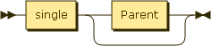
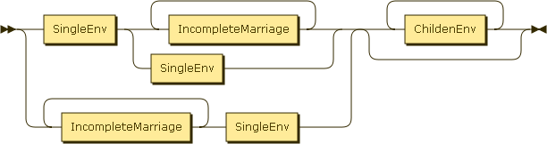
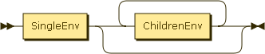
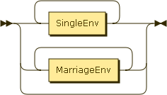

Analisis
=====================

Parser
------------------

### Diagrama de Estados

Grammar
--------------------

**singleEnv**

    ::= single Parent?

**MarriageEnv**

    ::= ( SingleEnv ( IncompleteMarriage+ | SingleEnv ) | IncompleteMarriage+ SingleEnv ) ChildenEnv*

**IncompleteMarriage**

    ::= SingleEnv ChildrenEnv*

ChildrenEnv:SingleEnvMarriageEnvChildrenEnv

    ::= SingleEnv*
      | MarriageEnv*

Algoritmo
------------------------

### Single

1.  Crear un nuevo *DOM::Person*
2.  Si el siguiente nodo es *FamilyTree::Parent*
    1.  Procesar el siguiente nodo y anotar los hermanos que hayan
        podido surgir.

3.  Si el siguiente nodo es *FamilyTree::Children*,
    *FamilyTree::Single*, *FamilyTree::Marriage*, terminar.
4.  Devolver *DOM::Person*

### Marriage

1.  Para cada token. En caso de que el token sea:
    1.  *FamilyTree::Single*
    2.  y se pueda añadir un single mas
        1.  procesar el single
        2.  Añadirlo a la relación

    3.  *FamilyTree::Marriage*
    4.  y el matrimonio sea incompleto
        1.  Procesar el matrimonio incompleto

    5.  *FamilyTree::Children*
        1.  Procesar los *Children*
        2.  Añadir la lista de *DOM::Person* como hijos

    6.  En otros casos *Error*

2.  Devolver el *DOM::Person* que sea familiar

### IncompleteMarriage

1.  Crear un *DOM::Relationship*
2.  Cuando sea *FamilyTree::single*
3.  Si no hay más de un *Single*
    1.  Procesar el *Single*
    2.  Añadirlo a la relación.

4.  Cuando sea *Children*
    1.  Procesar los *Children*
    2.  Añadir la lista de *Children* (*DOM::Person*) como hijos

### Children

1.  Para cada token
2.  En caso de que sea:
    1.  *FamilyTree::Single*
        1.  Procesar el *Single*

    2.  *FamilyTree::Marriage*
        1.  Procesar *Marriage*

    3.  Añadir a la *DOM::Person* a la lista de hijos.

3.  Devolver una lista de *DOM::Person*

En un número variable de ramas.
